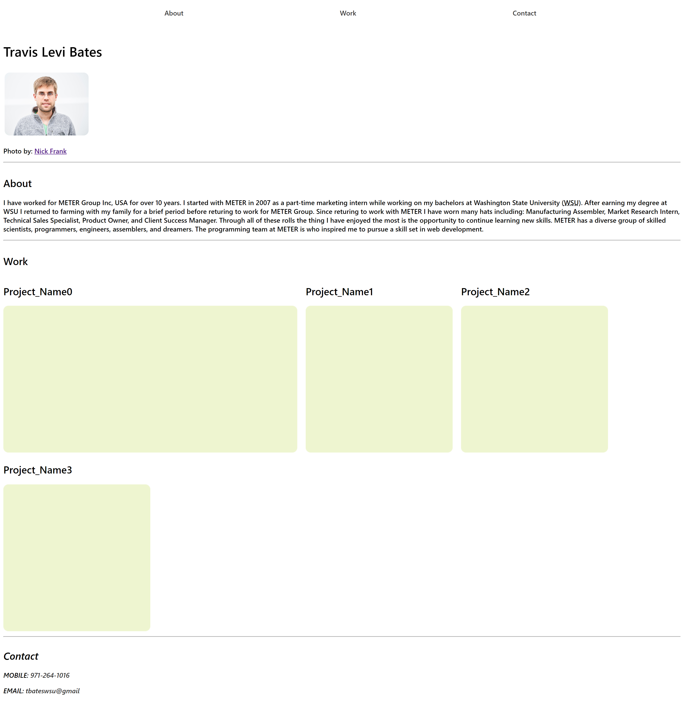
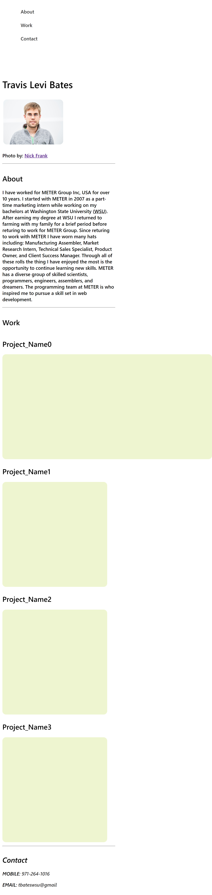

# <profile>

# Description

This project is my portfolio page where I will link all of my current work and future projects. 

Some or all of the current links may go to content that I have collaborated on, but not built myself using HTML, CSS and JavaScript etc and should not be considered a representation of my programming knowledge. These links are temporary and will be replaced with my own original content when it exists.

Temporary links include:

- https://zentracloud.com/accounts/login/?next=/ 
    -product for which I was the Product Owner at [METER Group](https://www.metergroup.com/).
- https://docs.zentracloud.com/l/en
    -Documentation page created using [HelpDocs](https://www.helpdocs.io/) and maintained by me.
- https://pullmanchildwelfare.org/
    -Website created and maintained by me using [squarespace](https://www.squarespace.com/).
- https://www.kaymbates.com/
    -Another website created and maintained by me using [squarespace](https://www.squarespace.com/).

## About

This website uses a simple section container with flex applied, allowing for multiple projects or additional sections to be added with new and varying content.

The layout of the page is designed to work on both desktop and mobile screens. When the screen resolution is smaller than 768px the navigation menu becomes a column and is no longer docked to the top of the page to allow for more vertical scrolling room.

## Mock Up
Desktop

Mobile

## View the Project
Navigate to [profile](https://levisgaragegroupinc.github.io/profile/) to view the live page.

## Credits
The HTML and CSS code layout are my own and original. 