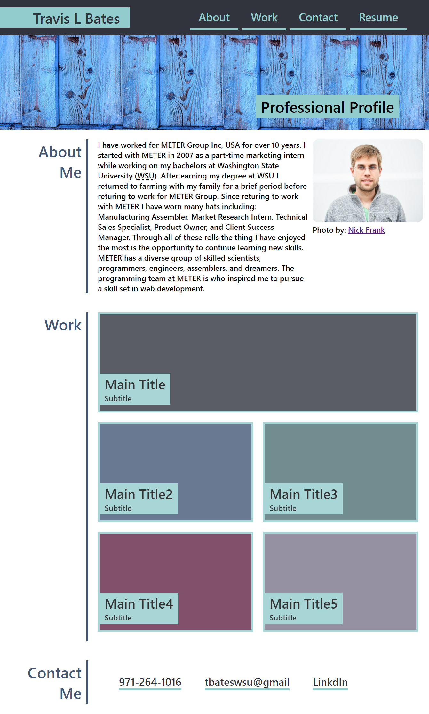
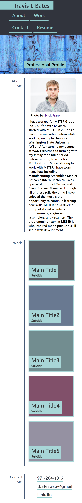

# <profile>

# Description

This project is my portfolio page where I will link all of my current work and future projects. 

## About

This website uses flexbox to create section labels on the left side of the page, with content on the write. Each individual section has flex properties applied to allow for dynamic content flow as the viewport width changes, or if additional items are added to the indiidual sections.

The layout of the page is designed to work on both desktop and mobile screens. When the screen resolution is smaller than 768px content in the About Me is is re-ordered to preserve a cleaner look, and the section titles are reduced.

### Desktop Mock Up

### Mobile Mock Up

## View the Project
Navigate to [profile](https://levisgaragegroupinc.github.io/profile/) to view the live page.

## Credits
The layout design is from UW Full stack course.